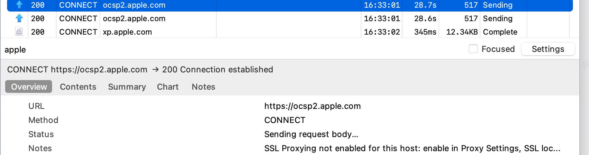

# 前言

有没有发现很多软件在 macOS 上启动很慢，比如 edge/ 微信 /chrome/ 会议软件等等。加载一个动态库时间甚至长达 10～20 秒，让人匪夷所思。你可能认为只有在 intel 芯片上才会如此，而在 Apple 芯片中仅首个动态库加载的时间也长达 5 秒，本文来一探究竟。

# 结论

- **macOS 中的 [XProtect](https://support.apple.com/zh-cn/guide/security/sec469d47bd8/web) 防病毒技术是导致耗时长的主要原因**（其他的因素比如 ocsp 签名校验、mac store 沙盒环境、是否有磁盘文件缓存无关不是主要因素)。
- 理论上只在 App 首次启动 /App 发生更改（在文件系统中）/XProtect 签名发生更新进行检查，**实测电脑未重启动情况下一段时间后重启软件 dll 加载时间很长（间隔不确定，可能是天也可能是小时），耗时堆栈均在 AppleSystemPolicy 中，应该是 XProtect 规则有更新导致**
- 恶意病毒扫描逻辑发生在 dlopen 内部加载 dll 文件时，内部执行 fcntl 函数并且参数是 **`F_CHECK_LV`**，此时会触发内核的安全机制（Mandatory Access Control AppleSystemPolicy），该检查逻辑最终运行在 syspolicyd 进程中通过 YARA 库逐个检查动态库是否包含病毒特征。
- 关闭 SIP 后会禁用 AppleSystemPolicy 策略，此时加载速度有明显的提升

> 题外话：macOS 上存在多种安全机制，包括 公证、gatekeeper（门禁）、MACF、AMFI 、SIP（[LINK](https://juejin.cn/post/6967199105541996575)）

# 探索

## ocsp 抓包

当搜索 mac app 启动慢，搜到了这个帖子 https://v2ex.com/t/1023166，结合几年前 apple 因为 ocsp 服务器宕机导致。

macOS 推荐使用 Charles 抓包，启动后走完引导流程之后就可以抓到 http/https 协议的包，如果需要对 https 协议的数据进行解包需要安装证书并且信任。


此外需要配置 ssl 代理，这里需要对 apple 的域名放行，不然 apple store 打不开。


抓包中发现有 ocsp.apple.com 相关请求，但不是 GET 请求，且并不会阻塞启动：


同时在断网的环境下测试仍然存在启动慢的问题，**基本上可以排除是网络原因**。

## instruments 采样

instruments 是一个非常强大工具，不逊色于 WPA。这里分别选择采集 cpu 负载（Time Profiler）、dyld 日志（dyld Activity）、系统内核调用，比如 fcntl/mmap 等等接口（System Call Trace）、磁盘占用（Disk Usage）情况。

### 采样 chrome

**这里以启动 chrome 为例。**


查看耗时情况，可以看到主要耗时在 dlopen_from 加载 `/ Applications/Google Chrome.app/Contents/Frameworks/Google Chrome Framework.framework/Versions/136.0.7103.114/Google Chrome Framework` 动态库，最终耗时在 `fcntl` 接口上。但是 `__fcntl` 后续没有具体实现的堆栈了。


这个主动态库文件大小 400MB 多，为啥这个动态库体积这么大，因为是 universal 构建，导致体积翻倍：

```C++
lipo -info "/Applications/Google Chrome.app/Contents/Frameworks/Google Chrome Framework.framework/Versions/136.0.7103.114/Google Chrome Framework"

Architectures in the fat file: /Applications/Google Chrome.app/Contents/Frameworks/Google Chrome Framework.framework/Versions/136.0.7103.114/Google Chrome Framework are: x86_64 arm64
```

一开始猜测只是因为 dll 体积大，首次加载时间长，但是 macOS SSD 硬盘加载 400MB，应该在 1s 左右的时间，并且可以看 instruments 中的 disk usage 视图，实际磁盘的时间只有几十 ms，因此排除了磁盘问题。

推测可能是签名校验逻辑，因为从 system call trace 视图里可以找到 fcntl 的调用参数，三个参数分别是：

- 参数 1：0x3 ，对应文件描述符
- 参数 2：0x62：10 进制 98，对应 `F_CHECK_LV`，会检查这个文件是否允许映射到当前的进程里

```C++
#define F_CHECK_LV              98      /* Check if Library Validation allows this Mach-O file to be mapped into the calling process */
```

- 参数 3：是一个结构体：

```C++
typedef struct fchecklv {
    off_t           lv_file_start;
    size_t          lv_error_message_size;
    void            *lv_error_message;
} fchecklv_t;
```
trace 里看不到参数信息，在 lldb 中调试了一下是 0，剩下的两个用来存储 fcntl 错误信息的。

```Bash
# 断点
breakpoint set -n fcntl -s dyld
# 参数1
p $x0
# 参数2
p $x1
# 参数3地址
register read ×3
x000000016dd011f8
# 参数3偏移16个字节就是lv_error_message其实字段位置地址
p*(void **)(0x000000016dd011f8 + 16)
(void *) 0x000000016ddgodb8
# 打印lv_error_message字段
p (char *) 0x000000016ddgodb8
(char *) 0x000000016ddoodb8 ""
```

因此需要进一步分析 fcntl 为什么耗时这么久，以及 `F_CHECK_LV` 具体做了什么事情？

### 一些弯路

当进一步分析问题的时候，这里走了几个弯路：

- **demo 分析**：确认了是 dlopen->fcntl 链路的耗时之后，应该直接写一个 demo 进一步验证和分析原因，而不是在分析的原有的软件堆栈，因为原有堆栈可能混杂其他逻辑非常干扰

- **内核堆栈**：instruments 默认不会抓内核相关的堆栈的，需要打开 Record Kernel Callstacks 才可以。一开始以为 instruments 不支持抓内核堆栈，花费时间研究 dyld 源码后，发现 spindump 支持采集内核 stack，因此后面都是使用 spindump 采集堆栈分析（在阅读堆栈上比 instruments 麻烦了一点）。


- **采样频率**：Instruments 的 Time Profile 默认采样频率是 1ms，开启 [High Freqency](https://developer.apple.com/forums/thread/704837) 后采样频率为 100us（0.01ms）100us 仍然可能会有一些堆栈抓不到，可以使用 spindump 最快可以支持 1us（注意即使设置了很小的采样频率，实际采样间隔可能不完全准确一致）。有些函数执行很快，实际采样频率可能达不到 1us，因此有些函数调用就会丢失，会误导我们以为逻辑变了。

spindump 常用的一些命令行参数：

```
# 和活动监视器效果一致
sudo spindump <pid/process name> -file ~/Desktop/app_launch_spindump_2.2.txt 

# 修改采样频率，10表示总采样时间，1表示1ms采样频率，最小是1ms的频率
sudo spindump <pid/process name> 10 1 -file ~/Desktop/app_launch_spindump_2.2.txt 

# 只针对当前进程采样，此时采集频率单位可以使用微秒！可以采集给完整的堆栈信息
sudo spindump fcntl_test 20 10u -onlyTarget -proc fcntl_test -file ~/Desktop/fcntl_test_spindump_1.txt

# 等待进程启动后再采样，并且只抓自己的进程
sudo spindump Chromium 20 1u -wait -onlyTarget -file ~/Desktop/chromium_spindump_1.txt
```

## dyld 源码分析

可以先阅读源码进一步了解 dlopen 函数做了哪些事情。

首先获取自己系统 dyld 版本，我的版本是 PROJECT:dyld-1160.6

```Bash
what /usr/lib/dyld
```

接着在 https://github.com/apple-oss-distributions/dyld 找到对应的 tag 下载。

这里抛砖引玉简单介绍 dlopen 这个函数的相关逻辑。

### Loader

每个 mach-o 格式文件加载都**需要先创建一个 loader**，mach-o 文件的类别有：

- 可执行文件
- libsystem.dylib
- libdyld.dylib
- 其他三方 dylib

这里有一个概念是 dyld_shared_cache 的概念 [LINK](https://theapplewiki.com/wiki/Dev:Dyld_shared_cache)。macOS 中的系统库加载为了优化耗时：

- 系统安装完成之后，系统动态库合入成一个大的 dyld_shared_cache 物理文件
- 系统启动之后会把 dyld_shared_cache 映射到内存里（这里是内存映射并非完全将文件读入到磁盘上）。

其中 loader 作为基类有两个派生类：

- PrebuiltLoader：预构建的 loader 包含了一些 mach-o 中的信息，比如依赖关系等等
- JustInTimeLoader：每次都需要解析 mach-o 获取信息（通过 MachOAnalyzer）

选择 loader 的逻辑：

- 当加载一个动态库的时候，首先判断是否在 dyld_shared_cache 文件中，如果在，则使用 PreBuiltLoader，否则使用 JustInTimeLoader。
- Apple 还有一个机制是当可执行文件通过 JustInTimeLoader 加载，可执行文件依赖的所有动态库依赖加载完成后（不包括 dopen 动态加载的动态库），dyld 会将每个 JustInTimeLoader 克隆保存到 PrebuiltLoader，构建一个可执行文件级别的 PrebuiltLoaderSet，并写入磁盘，这样后续启动可执行文件的时候，启动速度就能能有一定的提升。

JustInTimeLoader 保存到 PrebuiltLoader 的机制判断条件见 RuntimeState::allowNonOsProgramsToSaveUpdatedClosures，目前 macos 不支持这种机制。

### APIs::dlopen_from

chrome 启动场景下就是第四种，通过 dlopen 加载加载业务自己的动态库，因此一定是通过 JustInTimeLoader 加载的，因此这里代码删掉一些无关的逻辑：

- 记录加载指定动态库之前进程已经 loaded 的 mach-o 文件数量
- Loader::getLoader 加载动态库
- loadDependents 加载该动态库的依赖
- 对这个过程中的新创建的 loader 调用 applyFixups 进行一些位置信息的修正等。

```C++
void* APIs::dlopen_from(const char* path, int mode, void* addressInCaller)
{
    // ...
    locks.withLoadersWriteLock(memoryManager, [&] {
        // since we have the dyld lock, any appends to state.loaded will be from this dlopen
        // so record the length now, and cut it back to that point if dlopen fails
        // 1. 记录load之前的数目
        const uint64_t startLoaderCount = loaded.size();
        const uint64_t startPatchedObjCClassesCount = this->patchedObjCClasses.size();
        const uint64_t startPatchedSingletonsCount = this->patchedSingletons.size();
        Diagnostics     diag;
    
        // try to load specified dylib
        // 2. 加载动态库
        topLoader = Loader::getLoader(diag, *this, path, options);
    
        // load all dependents
        // 3. 加载该动态库的依赖
        ((Loader*)topLoader)->loadDependents(diag, *this, depOptions);
    
        // only do fixups and notifications if new dylibs are loaded (could be dlopen that just bumps the ref count)
        STACK_ALLOC_VECTOR(const Loader*, newLoaders, loaded.size() - startLoaderCount);
        
        for (uint64_t i = startLoaderCount; i != loaded.size(); ++i)
            newLoaders.push_back(loaded[i]);
            DyldCacheDataConstLazyScopedWriter cacheDataConst(*this);
            if ( diag.noError() && !newLoaders.empty() ) {
                // tell debugger about newly loaded images in case there is a crash during fixups
        
                notifyDebuggerLoad(newLoaders);
        
                // proactive weakDefMap means we update the weakDefMap with everything just loaded before doing any binding
                if ( config.process.proactivelyUseWeakDefMap ) {
                    Loader::addWeakDefsToMap(*this, newLoaders);
                }
        
                // do fixups
                // 4.位置信息修正
                {
                    dyld3::ScopedTimer fixupsTimer(DBG_DYLD_TIMING_APPLY_FIXUPS, 0, 0, 0);
        
                    for ( const Loader* ldr : newLoaders ) {
                        bool allowLazyBinds = ((mode & RTLD_NOW) == 0);
                        ldr->applyFixups(diag, *this, cacheDataConst, allowLazyBinds);
                        if ( diag.hasError() )
                            break;
        
        #if BUILDING_DYLD && !TARGET_OS_EXCLAVEKIT
        // Roots need to patch the uniqued GOTs in the cache
                        //FIXME: Is the right place to conditionalize this?
                        ldr->applyCachePatches(*this, cacheDataConst);
        #endif // BUILDING_DYLD && !TARGET_OS_EXCLAVEKIT
        
        }
        
                }
        
    return result;
}

```

locks.withLoadersWriteLock 函数 的参数有一个 callback，捕获了 &，体现在堆栈里就是 `::$_1::operator()()`

```C++
65467  dyld4::APIs::dlopen_from(char const*, int, void*)::$_1::operator()() const + 244 (dyld + 264632) [0x19d0d89b8]
```

### JustInTimeLoader::makeJustInTimeLoaderDisk

Loader::getLoader 内部创建 JustInTimeLoader，调用的是 JustInTimeLoader::makeJustInTimeLoaderDisk 函数，具体逻辑如下：

- withReadOnlyMappedFile：mmap loadPath，获取到真正的 canonicalPath 路径
- mapSegments：先校验 canonicalPath 路径的签名，再校验 canonicalPath 这个文件是否可以加载到进程里，最后再将 regions mmap 到内存中

```C++
Loader* JustInTimeLoader::makeJustInTimeLoaderDisk(Diagnostics& diag, RuntimeState& state, const char* loadPath,
const LoadOptions& options, bool overridesCache, uint32_t overridesCacheIndex,
                                               const mach_o::Layout* layout)

{

    __block Loader* result = nullptr;
    bool  checkIfOSBinary = state.config.process.archs->checksOSBinary();
    // 1. 获取真正的动态库 path: canonicalPath
    state.config.syscall.withReadOnlyMappedFile(diag, loadPath, checkIfOSBinary, ^(const void* mapping, size_t mappedSize, bool isOSBinary, const FileID& fileID, const char* canonicalPath) {
     JustInTimeLoader::withRegions(ma, ^(const Array<Region>& regions) {

        CodeSignatureInFile  codeSignature;
        bool hasCodeSignature = ma->hasCodeSignature(codeSignature.fileOffset, codeSignature.size);
        // 2. 将文件mmap到内存中
        if ( const MachOAnalyzer* realMA = Loader::mapSegments(diag, state, canonicalPath, vmSpace, codeSignature, hasCodeSignature, regions, neverUnload, false, fileValidation) ) {
            // 3. 构造 JustInTimeLoader 对象
            result = JustInTimeLoader::make(state, realMA, canonicalPath, fileID, fileValidation.sliceOffset, neverUnload, leaveMapped, overridesCache, overridesCacheIndex, layout);
        }
        
      });
      
    });
    
    return result;
}
```

state.config.syscall.withReadOnlyMappedFile 函数的参数没有捕获 &，体现在堆栈里就是 `invocation function for block in`：

```C++
65433  invocation function for block in dyld4::JustInTimeLoader::makeJustInTimeLoaderDisk(Diagnostics&, dyld4::RuntimeState&, char const*, dyld4::Loader::LoadOptions const&, bool, unsigned int, mach_o::Layout const*) + 460 (dyld + 149292) [0x19d0bc72c]
```

#### withReadOnlyMappedFile

这里逻辑就是传入一个 path，返回一个最终要加载的 path 执行 callback。

```C++

void SyscallDelegate::withReadOnlyMappedFile(Diagnostics& diag, const char* path, bool checkIfOSBinary,
void (^handler)(const void* mapping, size_t mappedSize, bool isOSBinary, const FileID& fileID, const char* realPath)) const
{

    size_t   mappedSize;
    FileID   fileID = FileID::none();
    bool     isOSBinary = false;
    char     realerPath[PATH_MAX];
    if ( const void* mapping = this->mapFileReadOnly(diag, path, &mappedSize, &fileID, (checkIfOSBinary ? &isOSBinary : nullptr), realerPath) ) {
        handler(mapping, mappedSize, isOSBinary, fileID, realerPath);
        this->unmapFile(mapping, mappedSize);
    }
}

```

#### Loader::mapSegments

- 先打开文件：通过 open 内核调用
- fcntl + F_ADDFILESIGS_RETURN 判断签名是否正确
- fcntl + F_CHECK_LV 判断文件是否可以加载到进程，这里涉及到 macOS 的安全机制

```C++

const MachOAnalyzer* Loader::mapSegments(Diagnostics& diag, RuntimeState& state, const char* path, uint64_t vmSpace,
const CodeSignatureInFile& codeSignature, bool hasCodeSignature,

                                     const Array<Region>& regions, bool neverUnloads, bool prebuilt, const FileValidationInfo& fileValidation)
{

    dyld3::ScopedTimer timer(DBG_DYLD_TIMING_MAP_IMAGE, path, 0, 0);

    // open file
    // 1. 打开文件
    int fd = state.config.syscall.open(path, O_RDONLY, 0);
    if ( fd == -1 ) {
        int openErr = errno;
        if ( (openErr == EPERM) && state.config.syscall.sandboxBlockedOpen(path) )
            diag.error("file system sandbox blocked open("%s", O_RDONLY)", path);
        else if ( openErr == ENOENT )
            diag.error("no such file");
        else
            diag.error("open("%s", O_RDONLY) failed with errno=%d", path, openErr);
        return nullptr;
    }
    
    #if BUILDING_DYLD
    // 2. 验证签名
    // register code signature
    uint64_t coveredCodeLength = UINT64_MAX;
    if ( hasCodeSignature && codeSignature.size != 0 ) {
        fsignatures_t siginfo;
        siginfo.fs_file_start = sliceOffset;                             // start of mach-o slice in fat file
        siginfo.fs_blob_start = (void*)(long)(codeSignature.fileOffset); // start of CD in mach-o file
        siginfo.fs_blob_size  = codeSignature.size;                      // size of CD
        int result            = state.config.syscall.fcntl(fd, F_ADDFILESIGS_RETURN, &siginfo);
        if ( result == -1 ) {
            char uuidStr[64];
            getUuidFromFd(state, fd, sliceOffset, uuidStr);
            int errnoCopy = errno;
            if ( (errnoCopy == EPERM) || (errnoCopy == EBADEXEC) ) {
                diag.error("code signature invalid in <%s> '%s' (errno=%d) sliceOffset=0x%08llX, codeBlobOffset=0x%08X, codeBlobSize=0x%08X",
                           uuidStr, path, errnoCopy, sliceOffset, codeSignature.fileOffset, codeSignature.size);
            }
            else {
                diag.error("fcntl(fd, F_ADDFILESIGS_RETURN) failed with errno=%d in <%s> '%s', sliceOffset=0x%08llX, codeBlobOffset=0x%08X, codeBlobSize=0x%08X",
                           errnoCopy, uuidStr, path, sliceOffset, codeSignature.fileOffset, codeSignature.size);
            }
            state.config.syscall.close(fd);
            return nullptr;
        }
        coveredCodeLength = siginfo.fs_file_start;
        // 比较文件开始的位置（codeSignature.fileOffset）和签名覆盖的长度（coveredCodeLength）
        if ( coveredCodeLength < codeSignature.fileOffset ) {
            char uuidStr[64];
            getUuidFromFd(state, fd, sliceOffset, uuidStr);
            diag.error("code signature does not cover entire file up to signature in <%s> '%s' (signed 0x%08llX, expected 0x%08X) for '%s'",
                       uuidStr, path, coveredCodeLength, codeSignature.fileOffset, path);
            state.config.syscall.close(fd);
            return nullptr;
        }
    }
    
    
    
    // <rdar://problem/41015217> dyld should use F_CHECK_LV even on unsigned binaries
    {
    
        // <rdar://problem/32684903> always call F_CHECK_LV to preflight
        fchecklv checkInfo;
        char     messageBuffer[512];
        messageBuffer[0]                = '0';
        checkInfo.lv_file_start         = sliceOffset;
        checkInfo.lv_error_message_size = sizeof(messageBuffer);
        checkInfo.lv_error_message      = messageBuffer;
        int res                         = state.config.syscall.fcntl(fd, F_CHECK_LV, &checkInfo);
        if ( res == -1 ) {
            // rdar://79796526 (include uuid of mis-signed binary to help debug)
            char uuidStr[64];
            getUuidFromFd(state, fd, sliceOffset, uuidStr);
            diag.error("code signature in <%s> '%s' not valid for use in process: %s", uuidStr, path, messageBuffer);
            state.config.syscall.close(fd);
            return nullptr;
        }
    }
    
    #endif
    
    
    // map each segment
    // 对每个region进行mmap，并且对第一个seg判断是否符合mach-o规则
    bool             mmapFailure               = false;
    const  bool      enableTpro                = state.config.process.enableTproDataConst;
    __block uint32_t segIndex                  = 0;
    for ( const Region& region : regions ) {
        // <rdar://problem/32363581> Mapping zero filled regions fails with mmap of size 0
        if ( region.isZeroFill || (region.fileSize == 0) )
            continue;
        if ( (region.vmOffset == 0) && (segIndex > 0) )
            continue;
        int perms = VM_PROT_READ;
        int flags = MAP_FIXED | MAP_PRIVATE;
    #if BUILDING_DYLD
    perms = region.perms;
    #endif
    
    if (enableTpro && region.readOnlyData) {
            flags |= MAP_TPRO;
        }
        void* segAddress = state.config.syscall.mmap((void*)(loadAddress + region.vmOffset), (size_t)region.fileSize, perms,
                                                     flags, fd, (size_t)(sliceOffset + region.fileOffset));
        int   mmapErr    = errno;
        // sanity check first segment is mach-o header
        if ( !mmapFailure && (segIndex == 0) ) {
            const MachOAnalyzer* ma = (MachOAnalyzer*)segAddress;
            if ( !ma->isMachO(diag, region.fileSize) ) {
                mmapFailure = true;
                break;
            }
    
        }
        ++segIndex;
    
    }
    
    // close file
    state.config.syscall.close(fd);
    return (MachOAnalyzer*)loadAddress;
}

```

## fcntl 源码分析

可以进一步研究一下 fcntl 的源码，看看当参数是 F_CHECK_LV，内核的逻辑是什么。

这个源码可以在 XNU 内核中找到，首先确认自己的内核版本，从 github 上下载对应 tag：https://github.com/apple-oss-distributions/xnu/tree/xnu-10063.101.15

```Bash
hewro@hewrodeMac-Studio ~ % uname -a
Darwin hewrodeMac-Studio.local 23.4.0 Darwin Kernel Version 23.4.0: Fri Mar 15 00:12:49 PDT 2024; root:xnu-10063.101.17~1/RELEASE_ARM64_T6020 arm64
```

我的系统版本 **10063.101.17** 在 github 上没有对应的 tag，只能下载了接近的一个版本。

### sys_fcntl_nocancel

这里只关注 F_CHECK_LV 的逻辑，其中关键逻辑是 mac_file_check_library_validation 调用。

```C++
int

sys_fcntl_nocancel(proc_t p, struct fcntl_nocancel_args *uap, int32_t *retval)
{

case F_CHECK_LV: {
        struct fileglob *fg;
        fchecklv_t lv = {};
#if CONFIG_MACF
        error = mac_file_check_library_validation(p, fg, lv.lv_file_start,
            (user_long_t)lv.lv_error_message, lv.lv_error_message_size);
#endif
        break;
    }
}
```

### mac_file_check_library_validation

```C++
int

mac_file_check_library_validation(struct proc *proc,
struct fileglob *fg, off_t slice_offset,
user_long_t error_message, size_t error_message_size)
{
    int error;
    MAC_CHECK(file_check_library_validation, proc, fg, slice_offset, error_message, error_message_size);
    return error;
}
```

```C++

#define MAC_POLICY_ITERATE(...) do {                                
    struct mac_policy_conf *mpc;                                    
    u_int i;                                                        
     
    for (i = 0; i < mac_policy_list.staticmax; i++) {               
        mpc = mac_policy_list.entries[i].mpc;                       
        if (mpc == NULL)                                            
                continue;                                                                                                                    
    }                                                               
    
    if (mac_policy_list_conditional_busy() != 0) {                  
        for (; i <= mac_policy_list.maxindex; i++) {                
                mpc = mac_policy_list.entries[i].mpc;               
                if (mpc == NULL)                                    
                        continue;                                   
    }                                                           
        mac_policy_list_unbusy();                                   
    }                                                               
    } while (0)
    
    #define MAC_CHECK(check, args...) do {                              
    error = 0;                                                      
    MAC_POLICY_ITERATE({                                            
        if (mpc->mpc_ops->mpo_ ## check != NULL) {              
                DTRACE_MACF3(mac__call__ ## check, void *, mpc, int, error, int, MAC_ITERATE_CHECK); 
                int *step_err = mpc->mpc_ops->mpo ## check (args); *
    _                DTRACE_MACF2(mac__rslt__ ## check, void *, mpc, int, __step_err); 
    error = mac_error_select(__step_err, error);         
        }                                                           
    });                                                             
    } while (0)

```

mac 的所有安全策略保存在 **mac_policy_list** 列表中，这里会调用每个 mac_policy_conf 中的 mpc_ops 中的 mpo_mac_file_check_library_validation 函数指针。

内核通过 mac_policy_register 接口提供了安全策略的注入，具体的安全策略本身不包含在内核源码中。

> security/mac_base.c

## demo 分析

demo 中启动程序后按下回车会执行 dlopen 函数加载动态库：

```C++
#include <iostream>
#include <fcntl.h>
#include <chrono>
#include <vector>
#include <string.h>
#include <errno.h>
#include <unistd.h>
#include <sys/stat.h>
#include <mach-o/dyld.h>
#include <dlfcn.h>

void dlopentest(const char* file_to_test){
    auto start_time = std::chrono::high_resolution_clock::now();

    void* library = dlopen(file_to_test,
                           // 为了解决未声明标识符 'RTLD_LAZY' 的问题，包含 dlfcn.h 头文件
                           // 该头文件定义了 RTLD_LAZY、RTLD_LOCAL 和 RTLD_FIRST 等常量
                           RTLD_LAZY | RTLD_LOCAL | RTLD_FIRST);
    if ( !library )
        std::cerr << "dlopen error for " << file_to_test << ": " << dlerror() << std::endl;
    else {
        std::cout << "dlopen success for " << file_to_test << std::endl;
    }
    auto end_time = std::chrono::high_resolution_clock::now();
    auto duration = std::chrono::duration_cast<std::chrono::microseconds>(end_time - start_time);

    std::cout << "fcall took: " << duration.count() << " microseconds." << std::endl;

}
int main(int argc, char* argv[])
{
    char     path[PATH_MAX];
    uint32_t size = sizeof(path);
    if ( _NSGetExecutablePath(path, &size) != 0 ) {
        std::cerr << "Error: Could not get executable path." << std::endl;
        return 1;
    }

    const char* file_to_test = path;
    if ( argc > 1 ) {
        file_to_test = argv[1]; // Allow specifying a file as an argument
        std::cout << "Testing on file: " << file_to_test << std::endl;
    }
    else {
        std::cout << "Testing on self: " << file_to_test << std::endl;
    }

    std::cout << "Press Enter to call dlopen on: " << file_to_test << std::endl;
    std::cin.get(); // 等待用户按下回车键

    dlopentest(file_to_test);
    return 0;
}

```

这里需要注意一点的是如果这个动态库依赖了其他的库，需要编译的时候指定搜索路径（rpath）：

```C++
clang++ -o fcntl_test_n_mas fcntl_test.cpp -Wl,-rpath,"/Applications/Google Chrome.app/Contents/Frameworks/Google Chrome Framework.framework/Versions/136.0.7103.114/Libraries"

./fcntl_test "/Applications/Google Chrome.app/Contents/Frameworks/Google Chrome Framework.framework/Versions/136.0.7103.114/Google Chrome Framework"
```

### 首次启动（SIP）

首先只抓自己这一个进程的 spindump，这样提交小，并且可以间隔很短（5us）：

[fcntl_test_spindump_500us_1.txt](./media/fcntl_test_spindump_500us_1.txt)

先看基本信息，采集了 10s，一共抓了 71066 个 sample。

```C++
Duration:         10.13s
Duration Sampled: 10.13s
Steps:            71066 (5us sampling interval)
```

从堆栈上看，有 65447 次 sample（93%）都在 getLoader 中，其中内核堆栈是 AppleSystemPolicy::perform_malware_scan_if_necessary，表示在进行恶意软件扫描的工作。


在 kext 内核扩展中确实也找到了 AppleSystemPolicy 这个扩展。


### 非首次启动（SIP）

当应用退出后很快启动会发现这个时候启动非常快，几十到几百耗时级别，初步推测可能是因为文件内存缓存的原因。

但是发现一个疑点，即可执行文件 A 加载动态库 a 一次后，退出 A 重新加载动态库 a，很快。但是可执行文件 B 加载动态库 a 仍然很慢，**这说明这里判断条件不仅仅是文件是否在内存缓存里，可能有别的判断逻辑。**

一开始通过 instruments 抓取堆栈发现二次启动的时候没有 getLoader 的函数了，但这是不符合我们的源码分析的。从源码里看没有看到判断是否在内存缓存就跳过 loader 的流程。

通过 spindump 1us 频率采集会发现基本的调用栈和首次启动基本一致，但是区别在于没有看到 fcntl 调用。


[fcntl_test_spindump_500us_2_2.txt](./media/fcntl_test_spindump_500us_2_2.txt)

怀疑是不是用户态逻辑里是不是就存在某个条件判断分支。后来重复实验发现非首次启动有采集到 Loader::mapSegments 的堆栈，但是仍然没有 fcntl 的调用。

**最后在 instruments 的 system call trace 面板下确认了非首次启动下仍然有 fcntl 调用，只是周期性采集中无法采集到，但是底层调用里没有 AppleSystemPolicy 的逻辑。**


### 首次（非 SIP）

当关闭 SIP 之后，首次启动也变的非常的快。

[app_launch_spindump_no_sip.txt](./media/app_launch_spindump_no_sip.txt)

重新抓一个 spindump 对比发现，**fcntl `F_CHECK_LV` 底层逻辑，只包含 _vnode_check_signature 的逻辑了（这个逻辑在开启 SIP 也是存在的），不再包含 AppleSystemPolicy 的逻辑。** （尽管此时在 kext 扩展中仍然可以找到 AppleSystemPolicy）。


## 安全机制

AppleSystemPolicy 是什么工作会如此耗时，从堆栈的函数参数找到线索：

```Bash
ASPEvaluationManager::waitOnEvaluation(syspolicyd_evaluation*) + 48 (com.apple.AppleSystemPolicy + 13368) [0xfffffe0009e30d88]
```

`syspolicyd_evaluation` 中的 syspolicyd 就是一个系统进程。

因此在启动的过程中对这个进程抓一下 trace 确认一下这个进程的逻辑（或者 spindump 默认抓所有进程）。可以看到主要逻辑在执行 yr_rules_scan_file，即使用 yr 的规则扫描文件。


### YARA 规则匹配

yr_rules_scan_file 函数堆栈中的 yr 就是 yara 的缩写，这个也是一个开源的库：

https://deepwiki.com/VirusTotal/yara

进而从 macOS 官网的恶意软件扫描上找到说明： https://support.apple.com/zh-cn/guide/security/sec469d47bd8/web

XProtect 会在以下时机扫描，这和我们实际的表现符合。

- App 首次启动
- App 发生更改（在文件系统中）
- XProtect 签名发生更新

**yara 扫描时间的影响因素：**

1. 文件大小：文件越大，扫描时间通常越长。
2. 规则复杂度：规则越复杂（特别是包含大量正则表达式的规则），匹配过程越耗时。
3. 规则数量：要应用的规则越多，扫描时间越长。
4. 硬件资源：可用内存和 CPU 性能会影响扫描速度。

# 相关讨论

- https://news.ycombinator.com/item?id=43858970 这个帖子讨论 macos 应用程序为什么这么慢的原因，这里有两个观点，一个是启动的时候会生成和 bundle 关联 hash 数据（只是猜测不可信），另一个观点就是 lapcat 博主的观点

  - Howard
    - https://eclecticlight.co/2025/04/22/why-some-apps-launch-very-slowly/
    - https://eclecticlight.co/2025/04/30/why-some-apps-sometimes-launch-extremely-slowly/
    - https://mjtsai.com/blog/2025/04/30/why-some-apps-sometimes-launch-extremely-slowly/
  - lapcat：lapcat 博客有很多对 macos 行为分析，从 spindump 入手，可信度高，和我们从 instrument 的结果也是一致的
    - https://lapcatsoftware.com/articles/2025/5/1.html 对 Howard 观点回应
    - https://lapcatsoftware.com/articles/2024/2/3.html

- [iOS 启动优化-dyld4 流程介绍](https://juejin.cn/post/7252540034679029818)
- https://deepwiki.com/apple-oss-distributions/dyld
- https://github.com/apple-oss-distributions/dyld/blob/main/doc/dyld4.md